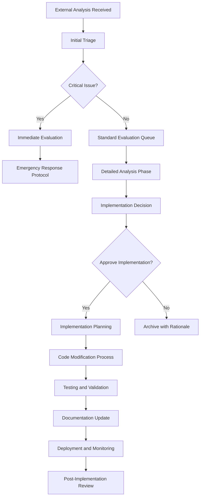

# External Analysis and Code Modification Management Rules

**Status**: Active Policy Document
**Created**: 2025-08-19
**Last Updated**: 2025-08-19
**Owner**: Claude Code
**Version**: 1.0
**Scope**: All external analysis integration and code modification activities

## Overview
This document establishes comprehensive rules and procedures for managing external analysis reports, integrating external recommendations, and implementing code modifications in the Gamma Hedge project. It ensures systematic evaluation, proper prioritization, and controlled implementation of external suggestions.

## Table of Contents
1. [External Analysis Management](#external-analysis-management)
2. [Analysis Evaluation Framework](#analysis-evaluation-framework)
3. [Code Modification Procedures](#code-modification-procedures)
4. [Integration Workflow](#integration-workflow)
5. [Quality Assurance](#quality-assurance)
6. [Documentation Requirements](#documentation-requirements)
7. [Review and Approval Process](#review-and-approval-process)

---

## External Analysis Management

### 1. External Analysis Sources

#### Recognized External Sources
- **AI Analysis Tools**: Automated code analysis and architectural reviews
- **Third-party Reviews**: External developer or consultant assessments
- **Academic Analysis**: Research-based theoretical evaluations
- **Industry Tools**: Commercial analysis platforms and static analyzers
- **Peer Reviews**: Code reviews from external development teams

#### Source Classification
| Source Type | Trust Level | Required Validation | Implementation Priority |
|-------------|-------------|-------------------|----------------------|
| AI Analysis Tools | Medium | High | Case-by-case |
| Peer Reviews | High | Medium | High |
| Academic Analysis | High | High | Medium-High |
| Industry Tools | Medium-High | Medium | Medium |
| Unknown Sources | Low | Very High | Low |

### 2. Analysis Reception Protocol

#### Initial Processing
1. **Receipt Logging**
   - Date and time of analysis receipt
   - Source identification and classification
   - Analysis scope and focus areas
   - Initial relevance assessment

2. **Immediate Triage**
   - **Critical**: Security vulnerabilities, system-breaking issues
   - **High**: Performance problems, theoretical misalignments
   - **Medium**: Code quality improvements, architecture suggestions
   - **Low**: Style suggestions, minor optimizations

3. **Archive Placement**
   - Location: `docs/archive/external_analysis/`
   - Naming: `EXTERNAL_[YYYY-MM-DD]_[source]_[brief_description].md`
   - Metadata: Source, date, scope, initial assessment

### 3. Analysis Content Requirements

#### Required Information for Valid Analysis
- **Clear Problem Statement**: What issue is being addressed
- **Supporting Evidence**: Data, metrics, or specific code references
- **Impact Assessment**: How the issue affects system performance/correctness
- **Recommended Solution**: Specific, actionable recommendations
- **Implementation Guidance**: Steps or approach for implementing fixes

#### Incomplete Analysis Handling
- **Missing Evidence**: Request additional supporting information
- **Vague Recommendations**: Seek clarification on specific implementation steps
- **Unclear Impact**: Perform internal impact assessment
- **No Implementation Path**: Develop internal implementation strategy

---

## Analysis Evaluation Framework

### 1. Multi-Dimensional Evaluation Matrix

#### Technical Accuracy Assessment
| Criteria | Weight | Evaluation Questions |
|----------|--------|---------------------|
| **Theoretical Correctness** | 30% | Does the analysis align with established theoretical frameworks? |
| **Implementation Feasibility** | 25% | Can the suggested changes be realistically implemented? |
| **Code Understanding** | 20% | Does the analysis demonstrate accurate understanding of current code? |
| **Solution Appropriateness** | 15% | Are the proposed solutions suitable for the identified problems? |
| **Evidence Quality** | 10% | Is the supporting evidence compelling and verifiable? |

#### Business Impact Assessment
| Criteria | Weight | Evaluation Questions |
|----------|--------|---------------------|
| **Performance Impact** | 35% | Will implementation improve system performance? |
| **Risk Mitigation** | 30% | Does it address significant risks or vulnerabilities? |
| **Maintenance Benefit** | 20% | Will it improve long-term maintainability? |
| **Resource Efficiency** | 15% | Is the effort-to-benefit ratio favorable? |

#### Implementation Risk Assessment
| Risk Category | Assessment Criteria | Mitigation Requirements |
|---------------|-------------------|----------------------|
| **Breaking Changes** | Will it disrupt existing functionality? | Comprehensive testing plan required |
| **Performance Regression** | Could it negatively impact performance? | Benchmarking and rollback plan required |
| **Complexity Introduction** | Does it add unnecessary complexity? | Simplification alternatives required |
| **Dependency Issues** | Does it introduce problematic dependencies? | Dependency analysis and alternatives required |

### 2. Evaluation Process

#### Phase 1: Initial Assessment (Within 24 hours)
1. **Relevance Check**: Is the analysis relevant to current project state?
2. **Completeness Check**: Does it meet content requirements?
3. **Initial Classification**: Critical/High/Medium/Low priority
4. **Resource Estimation**: Rough estimate of implementation effort

#### Phase 2: Detailed Evaluation (Within 1 week)
1. **Technical Deep Dive**: Thorough technical accuracy assessment
2. **Impact Analysis**: Detailed business and technical impact evaluation
3. **Risk Assessment**: Comprehensive risk analysis with mitigation strategies
4. **Implementation Planning**: Detailed implementation approach and timeline

#### Phase 3: Decision and Documentation (Within 2 weeks)
1. **Final Recommendation**: Implement/Modify/Reject with detailed rationale
2. **Priority Assignment**: If implementing, assign priority level
3. **Resource Allocation**: Assign team members and timeline
4. **Documentation**: Create evaluation summary and integration plan

---

## Code Modification Procedures

### 1. Modification Categories

#### Category 1: Critical Security/Stability Fixes
- **Timeline**: Immediate implementation (within 24-48 hours)
- **Process**: Expedited review and testing
- **Approval**: Security lead approval required
- **Testing**: Focused security and stability testing

#### Category 2: Performance Optimizations
- **Timeline**: 1-2 weeks implementation
- **Process**: Performance benchmarking before and after
- **Approval**: Technical lead approval required
- **Testing**: Performance regression testing suite

#### Category 3: Architectural Improvements
- **Timeline**: 2-6 weeks implementation
- **Process**: Architecture review and design documentation
- **Approval**: Architecture board approval required
- **Testing**: Comprehensive integration testing

#### Category 4: Code Quality Enhancements
- **Timeline**: 1-4 weeks implementation
- **Process**: Code review and refactoring standards compliance
- **Approval**: Senior developer approval required
- **Testing**: Unit and integration testing

### 2. Implementation Standards

#### Pre-Implementation Requirements
1. **Backup Strategy**: Current code state preserved with rollback capability
2. **Test Plan**: Comprehensive testing strategy defined
3. **Documentation Plan**: Documentation updates identified and planned
4. **Risk Mitigation**: Identified risks with mitigation strategies
5. **Success Criteria**: Clear metrics for measuring implementation success

#### Implementation Process
1. **Feature Branch Creation**: Isolated development environment
2. **Incremental Development**: Small, reviewable commits
3. **Continuous Testing**: Running tests throughout development
4. **Documentation Updates**: Real-time documentation maintenance
5. **Review Checkpoints**: Regular progress reviews and validation

#### Post-Implementation Validation
1. **Functionality Verification**: All existing functionality preserved
2. **Performance Validation**: Performance improvements verified
3. **Integration Testing**: Full system integration confirmed
4. **Documentation Review**: All documentation accurately updated
5. **Stakeholder Sign-off**: Relevant stakeholders approve changes

### 3. Rollback Procedures

#### Rollback Triggers
- **Functionality Regression**: Existing features broken
- **Performance Degradation**: Unacceptable performance loss
- **Stability Issues**: System instability or crashes
- **Integration Failures**: Breaks integration with other systems
- **Data Integrity Issues**: Compromises data accuracy or consistency

#### Rollback Process
1. **Immediate Assessment**: Quick evaluation of issue severity
2. **Rollback Decision**: Go/no-go decision within 2 hours of issue detection
3. **System Restoration**: Restore to last known good state
4. **Impact Analysis**: Assess rollback impact and notify stakeholders
5. **Post-Rollback Review**: Analyze failure causes and prevention strategies

---

## Integration Workflow

### 1. External Analysis Integration Pipeline

### 2. Workflow Phases

#### Phase 1: Intake and Triage (0-24 hours)
- **Responsibility**: External Analysis Coordinator
- **Activities**: Initial assessment, classification, resource estimation
- **Deliverables**: Triage report, initial recommendation
- **Decision Point**: Continue to detailed evaluation or archive

#### Phase 2: Detailed Evaluation (1-7 days)
- **Responsibility**: Technical Analysis Team
- **Activities**: Deep technical review, impact assessment, risk analysis
- **Deliverables**: Comprehensive evaluation report, implementation plan
- **Decision Point**: Approve, modify, or reject recommendation

#### Phase 3: Implementation Planning (1-3 days)
- **Responsibility**: Development Team Lead
- **Activities**: Resource allocation, timeline planning, risk mitigation
- **Deliverables**: Implementation plan, timeline, resource assignments
- **Decision Point**: Confirm implementation approach and timeline

#### Phase 4: Implementation Execution (Variable)
- **Responsibility**: Assigned Development Team
- **Activities**: Code development, testing, documentation
- **Deliverables**: Implemented solution, test results, updated documentation
- **Decision Point**: Code ready for production deployment

#### Phase 5: Validation and Review (1-2 weeks post-implementation)
- **Responsibility**: Quality Assurance Team
- **Activities**: Performance monitoring, functionality validation, issue tracking
- **Deliverables**: Implementation success report, lessons learned
- **Decision Point**: Implementation considered successful or requires adjustment

---

## Quality Assurance

### 1. Analysis Quality Standards

#### Minimum Quality Requirements
- **Evidence-Based**: All claims supported by verifiable evidence
- **Specific**: Clear, actionable recommendations rather than vague suggestions
- **Contextual**: Demonstrates understanding of project context and constraints
- **Feasible**: Recommendations are technically and practically implementable
- **Measurable**: Success criteria can be objectively measured

#### Quality Assessment Checklist
- [ ] Problem statement is clear and specific
- [ ] Supporting evidence is provided and verifiable
- [ ] Recommendations are actionable and specific
- [ ] Implementation approach is outlined
- [ ] Expected benefits are quantified where possible
- [ ] Potential risks and mitigation strategies are identified
- [ ] Analysis demonstrates understanding of current codebase
- [ ] Recommendations align with project goals and constraints

### 2. Implementation Quality Gates

#### Pre-Implementation Quality Gates
1. **Design Review**: Architecture and approach validation
2. **Code Review**: Implementation quality assessment
3. **Test Plan Review**: Testing strategy validation
4. **Documentation Review**: Documentation completeness check
5. **Risk Assessment**: Risk mitigation strategy validation

#### During Implementation Quality Gates
1. **Milestone Reviews**: Regular progress and quality checkpoints
2. **Continuous Testing**: Automated test suite execution
3. **Code Quality Metrics**: Maintenance of quality standards
4. **Performance Monitoring**: Performance impact tracking
5. **Documentation Updates**: Real-time documentation maintenance

#### Post-Implementation Quality Gates
1. **Functionality Validation**: Comprehensive functionality testing
2. **Performance Assessment**: Performance improvement verification
3. **Integration Testing**: System integration validation
4. **Documentation Accuracy**: Documentation accuracy verification
5. **Stakeholder Acceptance**: User acceptance and sign-off

### 3. Continuous Improvement

#### Performance Metrics
- **Analysis Processing Time**: Time from receipt to decision
- **Implementation Success Rate**: Percentage of successful implementations
- **Rollback Rate**: Percentage of implementations requiring rollback
- **Benefit Realization**: Actual vs. predicted benefits
- **Quality Score**: Average quality assessment scores

#### Regular Reviews
- **Weekly**: Active analysis and implementation status review
- **Monthly**: Process effectiveness and quality metrics review
- **Quarterly**: Comprehensive process improvement review
- **Annually**: Strategic external analysis management review

---

## Documentation Requirements

### 1. External Analysis Documentation

#### Required Documentation for Each Analysis
1. **Analysis Evaluation Report**
   - Source and context information
   - Detailed technical assessment
   - Business impact analysis
   - Implementation recommendation
   - Risk assessment and mitigation

2. **Implementation Plan** (if approved)
   - Detailed implementation approach
   - Timeline and resource allocation
   - Testing and validation strategy
   - Documentation update plan
   - Success criteria and metrics

3. **Implementation Summary** (post-completion)
   - Implementation details and deviations
   - Test results and validation outcomes
   - Actual vs. predicted benefits
   - Lessons learned and recommendations

#### Documentation Standards
- **Template Compliance**: Use standardized templates for consistency
- **Completeness**: All required sections must be completed
- **Accuracy**: Information must be accurate and verifiable
- **Clarity**: Language must be clear and unambiguous
- **Traceability**: Clear links between analysis, decisions, and outcomes

### 2. Documentation Lifecycle

#### Creation Phase
- Use appropriate templates from `docs/templates/`
- Include all required metadata and headers
- Ensure completeness and accuracy before publication
- Link to related documents and dependencies

#### Maintenance Phase
- Update status as work progresses
- Maintain accuracy of information
- Update cross-references as needed
- Regular review for continued relevance

#### Archive Phase
- Create completion summary
- Archive to appropriate location in `docs/archive/`
- Update master documentation with key outcomes
- Maintain searchability through archive index

---

## Review and Approval Process

### 1. Review Hierarchy

#### Analysis Evaluation Reviews
1. **Initial Review**: External Analysis Coordinator
2. **Technical Review**: Senior Technical Team Member
3. **Business Review**: Project Stakeholder
4. **Final Approval**: Project Lead or Technical Director

#### Implementation Reviews
1. **Code Review**: Senior Developer or Tech Lead
2. **Architecture Review**: System Architect (for architectural changes)
3. **Security Review**: Security Lead (for security-related changes)
4. **Performance Review**: Performance Engineering (for performance changes)

### 2. Approval Criteria

#### Analysis Approval Criteria
- **Technical Merit**: Analysis demonstrates technical understanding and accuracy
- **Business Value**: Clear business benefit from implementing recommendations
- **Feasibility**: Implementation is technically and practically feasible
- **Risk Acceptance**: Identified risks are acceptable or properly mitigated
- **Resource Availability**: Required resources are available within reasonable timeframe

#### Implementation Approval Criteria
- **Code Quality**: Meets established coding standards and best practices
- **Test Coverage**: Adequate test coverage for new and modified code
- **Documentation**: Comprehensive and accurate documentation updates
- **Performance Impact**: No unacceptable performance degradation
- **Integration**: Proper integration with existing systems and processes

### 3. Escalation Procedures

#### When to Escalate
- **Disagreement on Technical Approach**: Technical team cannot reach consensus
- **Resource Conflicts**: Required resources not available within planned timeline
- **Risk Concerns**: Identified risks exceed acceptable thresholds
- **Business Impact Uncertainty**: Unclear business value or strategic alignment
- **External Dependencies**: Dependencies on external parties or systems

#### Escalation Process
1. **Document Issue**: Clear description of issue requiring escalation
2. **Gather Context**: Relevant background information and attempted solutions
3. **Identify Stakeholders**: Determine appropriate decision makers
4. **Present Options**: Available alternatives with pros/cons analysis
5. **Timeline for Decision**: Specify deadline for decision requirement
6. **Follow-up**: Ensure decision is communicated and implemented

---

## Emergency Procedures

### 1. Critical Security Issues

#### Immediate Response (0-2 hours)
1. **Issue Assessment**: Evaluate severity and scope of security issue
2. **Containment**: Implement immediate containment measures if necessary
3. **Notification**: Alert security team and project stakeholders
4. **Documentation**: Begin documenting issue and response actions

#### Short-term Response (2-24 hours)
1. **Root Cause Analysis**: Identify underlying cause of security issue
2. **Patch Development**: Develop and test security patch
3. **Stakeholder Communication**: Update stakeholders on status and timeline
4. **Deployment Planning**: Plan for emergency deployment if required

#### Medium-term Response (1-7 days)
1. **Comprehensive Fix**: Develop comprehensive solution beyond immediate patch
2. **Security Review**: Conduct thorough security review of affected systems
3. **Process Improvement**: Identify and implement process improvements
4. **Post-Incident Review**: Conduct post-incident analysis and lessons learned

### 2. System Stability Issues

#### Detection and Assessment
- **Automated Monitoring**: System monitoring alerts to stability issues
- **Manual Reporting**: Manual reporting mechanisms for observed issues
- **Impact Assessment**: Evaluate scope and severity of stability issues
- **Triage Decision**: Determine appropriate response level

#### Response Procedures
1. **Immediate Stabilization**: Take actions to restore system stability
2. **Issue Investigation**: Investigate root cause of stability issues
3. **Temporary Workarounds**: Implement temporary solutions if needed
4. **Permanent Resolution**: Develop and implement permanent fix
5. **Prevention Measures**: Implement measures to prevent recurrence

---

## Compliance and Governance

### 1. Compliance Requirements

#### Internal Compliance
- **Code Standards**: All implementations must meet established coding standards
- **Documentation Standards**: All documentation must meet quality requirements
- **Security Standards**: All changes must meet security requirements
- **Performance Standards**: All changes must meet performance requirements

#### Process Compliance
- **Review Requirements**: All changes must complete required review processes
- **Testing Requirements**: All changes must complete required testing
- **Approval Requirements**: All changes must receive required approvals
- **Documentation Requirements**: All changes must include required documentation

### 2. Governance Structure

#### Roles and Responsibilities
- **External Analysis Coordinator**: Manages intake and triage of external analysis
- **Technical Review Team**: Provides technical evaluation and recommendations
- **Implementation Team**: Executes approved implementations
- **Quality Assurance Team**: Validates implementation quality and success
- **Project Stakeholders**: Provide business perspective and final approval

#### Decision Authority
- **Technical Decisions**: Technical Review Team and System Architect
- **Business Decisions**: Project Stakeholders and Business Owner
- **Resource Decisions**: Project Manager and Resource Manager
- **Security Decisions**: Security Lead and Security Team
- **Emergency Decisions**: Incident Commander and Project Lead

### 3. Audit and Monitoring

#### Regular Audits
- **Process Compliance**: Regular audits of process adherence
- **Quality Compliance**: Regular audits of quality standard adherence
- **Documentation Compliance**: Regular audits of documentation completeness
- **Implementation Success**: Regular audits of implementation outcomes

#### Continuous Monitoring
- **Performance Monitoring**: Continuous monitoring of system performance
- **Quality Monitoring**: Continuous monitoring of code and implementation quality
- **Process Monitoring**: Continuous monitoring of process effectiveness
- **Stakeholder Satisfaction**: Regular monitoring of stakeholder satisfaction

---

## Version Control and Change Management

### 1. Document Version Control

#### Version Numbering
- **Major Changes**: Increment major version (1.0 → 2.0)
- **Minor Changes**: Increment minor version (1.0 → 1.1)
- **Editorial Changes**: Increment patch version (1.0.0 → 1.0.1)

#### Change Documentation
- **Change Log**: Maintain detailed change log for all document updates
- **Rationale**: Document rationale for all significant changes
- **Impact Assessment**: Assess impact of changes on existing processes
- **Communication**: Communicate significant changes to all stakeholders

### 2. Process Evolution

#### Regular Process Review
- **Monthly Reviews**: Review process effectiveness and identify improvements
- **Quarterly Updates**: Update processes based on lessons learned
- **Annual Overhaul**: Comprehensive review and update of all processes
- **Ad-hoc Updates**: Emergency updates for critical process issues

#### Stakeholder Feedback
- **Regular Feedback**: Collect regular feedback from process users
- **Satisfaction Surveys**: Conduct regular satisfaction surveys
- **Process Improvements**: Implement improvements based on feedback
- **Communication**: Communicate process changes and improvements

---

**Document Control**
- **Next Review Date**: 2025-11-19
- **Review Frequency**: Quarterly
- **Document Owner**: Claude Code
- **Approval Authority**: Project Technical Director

**Related Documents**
- `docs/DOCUMENTATION_MANAGEMENT_RULES.md` - Overall documentation management
- `docs/MASTER_DOCUMENTATION.md` - Current system state and architecture
- `docs/templates/analysis_template.md` - Template for analysis documentation
- `docs/archive/external_analysis/` - Historical external analysis reports